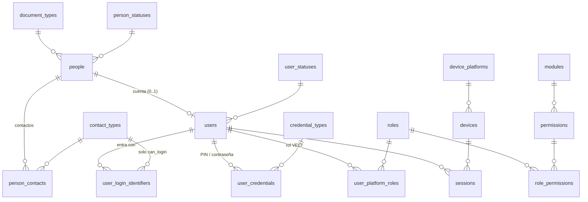

# 1. Identidad y acceso (`identity`)

Responde tres preguntas separadas: **quién es** la persona, **con qué cuenta entra** y **qué puede hacer**. Separarlas permite que un cliente registrado por el cajero exista sin cuenta, que una misma persona sea cliente en un comercio y cajera en otro, y que agregar un rol nuevo (acudiente, supervisor) sea insertar filas.

DDL: [02_identity.sql](sql/02_identity.sql) · Decisión: [ADR-0007](../adr/0007-persona-usuario-rol-membresia.md)

Las membresías del personal (usuario ↔ comercio ↔ rol) están en [comercios y sedes](02-comercios-y-sedes.md#membresías).

## Tablas

| Tabla | Qué guarda | Reglas clave |
| --- | --- | --- |
| `people` | Persona natural única en VECI: tipo y número de documento, nombres, estado. | Única por `(document_type_id, document_number)` (RF-CLI-06). Índice trigram para buscar por nombre. Al ejercer supresión (habeas data) pasa a `ANONYMIZED` y se reemplazan sus datos; sus movimientos contables se conservan. |
| `person_contacts` | Celulares, correos y WhatsApp de la persona. | Un solo contacto principal por tipo. No es único global: un celular familiar puede figurar en varias personas. |
| `users` | Cuenta para iniciar sesión, 1 a 1 con la persona. | Estado `PENDING_ACTIVATION` cuando el cajero registró al cliente o el propietario invitó a un cajero; pasa a `ACTIVE` al definir el PIN. |
| `user_login_identifiers` | Celular o correo con el que se entra. | Único en toda la plataforma mientras esté vigente. Una FK compuesta con `contact_types (id, can_login)` impide usar un tipo que no sirve para entrar. |
| `user_credentials` | PIN de 6 dígitos o contraseña, con hash Argon2id. | Una vigente por usuario y tipo. Restablecer = revocar con motivo y crear otra (HU-02-05). `failed_attempts` y `locked_until` aplican el bloqueo; el límite (5) y la duración (15 min) están en `credential_types`, no en código. |
| `roles` | Administrador VECI, Soporte VECI, Propietario, Cajero, Cliente. | `assignable_to_platform` y `assignable_to_membership` deciden dónde se puede asignar cada rol, y lo hacen cumplir con FK compuestas. |
| `permissions` | Acción atómica que un endpoint exige (`consumptions.register`). | Agrupadas por `core.modules`. El guard de NestJS verifica permisos, no nombres de rol. |
| `role_permissions` | Intermedia rol ↔ permiso. | Cambiar lo que puede hacer un cajero es editar esta tabla. |
| `user_platform_roles` | Intermedia usuario ↔ rol interno de VECI, con vigencia. | Solo roles con `assignable_to_platform`. |
| `devices` | Celular o navegador; el id lo genera el propio dispositivo. | Viaja en cada evento offline y en las sesiones. |
| `sessions` | Sesión por usuario y dispositivo con el hash del token de renovación. | Token de acceso de 15 min fuera de la base; aquí solo el de renovación. Cierre remoto = `revoked_at` + motivo `REMOTE_LOGOUT` (RF-AUT-06). |
| `login_attempts` | Cada intento de inicio de sesión. | Particionada por mes, solo inserción. Guarda el hash del identificador, no el celular en claro. |

## Cómo se resuelve un permiso

1. El token trae `user_id`, el comercio activo y la persona.
2. El guard busca la membresía vigente del usuario en ese comercio con un estado que `allows_login`.
3. Une `membership_roles` vigentes → `role_permissions` → `permissions` y comprueba el código que exige el endpoint.
4. Para el modo Cliente no hay membresía: el rol `CUSTOMER` se obtiene por tener una afiliación activa, y sus permisos (`me.*`) solo alcanzan los datos propios gracias a RLS.

## Catálogos del módulo

`person_statuses`, `user_statuses` (con transiciones), `credential_types`, `credential_revocation_reasons`, `login_failure_reasons`, `session_revocation_reasons`, `device_platforms`. Valores sembrados en [20_semillas_catalogos.sql](sql/20_semillas_catalogos.sql); roles y permisos en [21_semillas_seguridad_planes.sql](sql/21_semillas_seguridad_planes.sql).
