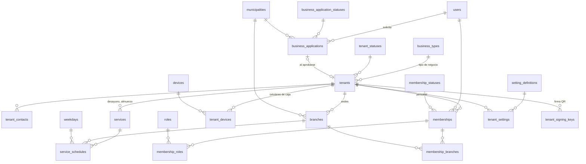

# 2. Comercios y sedes (`tenancy`)

El comercio (*tenant*) es la raíz del aislamiento: casi toda fila de negocio lleva su `tenant_id`. Aquí viven también el personal, los horarios de servicio y los ajustes que cada comercio puede cambiar sin tocar código.

DDL: [03_tenancy.sql](sql/03_tenancy.sql) · Decisión: [ADR-0002](../adr/0002-multi-comercio-con-rls.md)

## Tablas

| Tabla | Qué guarda | Reglas clave |
| --- | --- | --- |
| `business_types` | Restaurante, cafetería, panadería, colegio, tienda, otro. | Nuevo sector = nueva fila (RF-COM-04, RNF-ESC-02). |
| `business_type_services` | Plantilla: servicios con que nace cada tipo de negocio y su horario sugerido. | Al registrar un comercio se copian sus servicios; las horas las confirma el dueño ([ADR-0016](../adr/0016-alta-de-comercios-horarios-y-sedes.md)). |
| `business_applications` | Solicitud de una persona para registrar su negocio: los datos del alta, el municipio, quién la revisó y el motivo si se rechazó. | Una abierta por persona. Estados en catálogo: en revisión, aprobada (crea el comercio) y rechazada. RLS: el solicitante ve las suyas y la plataforma las decide ([ADR-0019](../adr/0019-roles-solicitudes-de-negocio-y-cobertura.md)). |
| `tenants` | Comercio: nombre, documento (NIT o cédula), tipo, estado, moneda, zona horaria, logo. | `slug` único para el enlace público. El estado es administrativo (alta, activo, suspendido, cerrado); el estado de pago vive en `billing.subscriptions`. |
| `tenant_contacts` | Teléfonos y correos del comercio. | Uno principal por tipo. |
| `branches` | Sede con municipio (DIVIPOLA) y dirección. | Una sola sede principal por comercio; nace con el comercio (HU-03-01). |
| `memberships` | Intermedia usuario ↔ comercio para el personal. | Única por `(tenant_id, user_id)`. Estados: invitado, activo, suspendido, retirado (RF-AUT-05). |
| `membership_roles` | Intermedia membresía ↔ rol, con vigencia. | Solo roles `assignable_to_membership`. Revocar un rol cierra la fila: queda la historia de permisos (RNF-SEG-05). |
| `membership_branches` | Intermedia membresía ↔ sede: dónde trabaja cada cajero. | Sin filas = todas las sedes (decisión de la aplicación en el plan Básico, que tiene una sola). |
| `tenant_devices` | Celulares autorizados como caja de un comercio. | Revocar uno cierra sus sesiones (HU-02-06). |
| `services` | Servicios que el comercio ofrece (desayuno, almuerzo, cena; en un colegio, recreo). | Nombre único por comercio. |
| `service_schedules` | Horario de cada servicio por sede y día de la semana. | Restricción de exclusión: dos horarios activos de la misma sede no se solapan el mismo día dentro del mismo periodo de vigencia (HU-03-02). Un turno que pasa la medianoche se registra en dos filas. |
| `setting_definitions` | Parámetros configurables: tipo de dato, valor por defecto, mínimo y máximo. | Aviso de renovación en N unidades, días de inactividad, minutos para reversar, hora del resumen diario... |
| `tenant_settings` | Valor que un comercio da a un parámetro. | Sin fila, aplica el valor por defecto. |
| `tenant_signing_keys` | Claves con que se firman los QR del comercio. | La pública baja al celular del cajero para verificar sin internet; la privada vive en el gestor de secretos y aquí solo su referencia. Una activa a la vez, rotables ([ADR-0005](../adr/0005-qr-firmado-por-comercio.md)). |

## Alta de un comercio (HU-03-01)

El dueño radica una solicitud (`business_applications`) solo en un municipio atendido (`core.municipalities.is_served`, hoy Mocoa). Al aprobarla, Administración VECI corre el alta en una sola transacción, con `app.user_id` y `app.tenant_id` fijados, y la solicitud queda con el `tenant_id` nuevo ([ADR-0019](../adr/0019-roles-solicitudes-de-negocio-y-cobertura.md)). El alta es: `tenants` (estado `ONBOARDING`) → `tenant_contacts` → `branches` (principal) → `services` (de la plantilla del tipo) → `memberships` + `membership_roles` (propietario) → `billing.subscriptions` (plan `TRIAL`, por la política `tenant_starts_trial`). Si registra Administración VECI, el propietario llega por invitación con PIN temporal. Cuando el dueño tiene horarios y lo abre, el comercio pasa a `ACTIVE` ([ADR-0016](../adr/0016-alta-de-comercios-horarios-y-sedes.md)). La clave de firma de QR se crea con EP-04.

## Horarios vigentes (HU-03-02)

Editar un horario cierra la vigencia del anterior en la fecha local del negocio (`tenancy.current_local_date()`) y crea uno nuevo desde hoy; pausar cambia `is_active`. Un horario está vigente si `tenancy.still_valid(valid_during)`: no terminó antes de hoy, aunque su fecha UTC por defecto empiece mañana. La caja los baja con `ETag` (la mayor `sync_version`).
