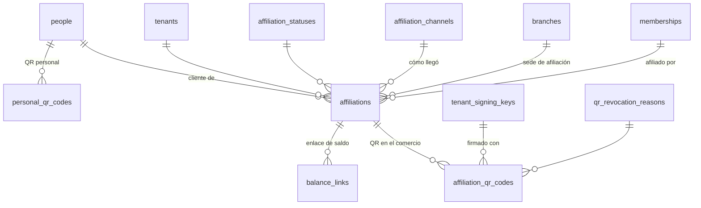

# 3. Clientes y afiliación (`customers`)

Un cliente no es una tabla propia: es una **persona** (`identity.people`) **afiliada** a un comercio. Así una persona que compra en tres negocios existe una sola vez en VECI y tiene tres afiliaciones, tres QR distintos y tres historiales que ningún comercio comparte con otro (RF-CLI-06).

DDL: [04_customers.sql](sql/04_customers.sql) · Decisiones: [ADR-0005](../adr/0005-qr-firmado-por-comercio.md), [ADR-0007](../adr/0007-persona-usuario-rol-membresia.md)

## Tablas

| Tabla | Qué guarda | Reglas clave |
| --- | --- | --- |
| `personal_qr_codes` | Versión vigente del QR personal del cliente (RF-CLI-02). | El QR lleva un token firmado por VECI con `person_id` y versión; sirve solo para afiliarse. Regenerarlo revoca el anterior (HU-04-02). |
| `affiliations` | Intermedia persona ↔ comercio: el cliente "en" un negocio. | Única por `(tenant_id, person_id)`. Guarda canal (escaneo de QR personal o registro asistido), sede, quién afilió y estado (activa, bloqueada, retirada). |
| `affiliation_qr_codes` | QR único del cliente en ese comercio (RF-CLI-03). | Token = firma(afiliación + comercio + versión) con la clave activa del comercio. Uno vigente por afiliación; revocar exige motivo (HU-06-07). No guarda saldo. |
| `balance_links` | Enlace web para consultar saldo sin app (RF-APC-03). | Solo el hash del token. Uno vigente por afiliación; regenerable. |

## Flujos

**Auto-registro (HU-04-01).** `people` → `person_contacts` → `users` (`ACTIVE`) → `user_login_identifiers` (celular) → `user_credentials` (PIN) → `compliance.consents` → `personal_qr_codes` versión 1.

**Afiliación por QR personal (HU-04-03).** El cajero escanea, la API verifica la firma de VECI, encuentra a la persona y crea `affiliations` (canal `PERSONAL_QR_SCAN`) + `affiliation_qr_codes` versión 1. Si ya existía la afiliación, la restricción única lo detecta y la app abre su ficha.

**Registro asistido sin app (HU-04-04).** El cajero consulta `customers.find_person_by_document(...)`: una función que busca en toda la plataforma pero devuelve solo el id, el nombre abreviado y el documento enmascarado (`******5678`). Si existe, se afilia esa persona; si no, se crea `people` + `person_contacts` + `affiliations` (canal `ASSISTED_REGISTRATION`) + consentimiento capturado por el cajero, y `users` queda en `PENDING_ACTIVATION` hasta que el cliente active su app.

## Privacidad (HU-12-04)

- La política RLS de `identity.people` muestra a un comercio solo las personas afiliadas a él o que trabajan en él.
- El enmascarado del documento para el cajero se hace en la capa de presentación según el permiso `customers.view_full_document`, que solo tiene el propietario.
- Solo se guardan nombre, celular y documento (RNF-LEG-02).
