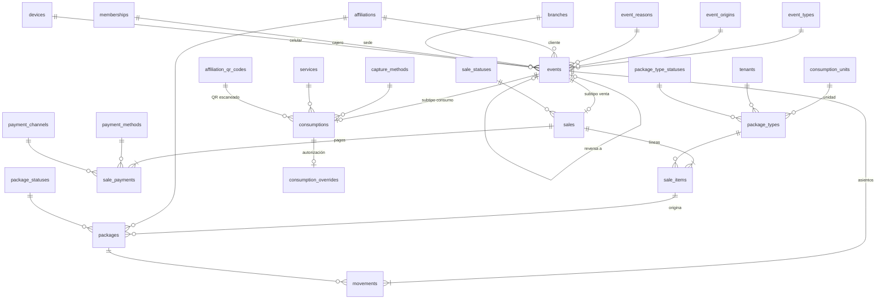

# 4. Tiqueteras, ventas y consumos (`prepaid`, `ledger`, `sales`, `consumptions`)

Es el corazón de VECI: el dinero que el cliente ya pagó y las unidades que el comercio le debe. Se modela como un **libro contable de unidades**: cada hecho es un evento inmutable y cada evento deja asientos (movimientos) en una o varias tiqueteras. El saldo es la suma de los asientos.

DDL: [05](sql/05_prepaid_oferta.sql), [06](sql/06_ledger_eventos.sql), [07](sql/07_sales.sql), [08](sql/08_prepaid_tiqueteras.sql), [09](sql/09_ledger_movimientos.sql), [10](sql/10_consumptions.sql) · Decisión: [ADR-0003](../adr/0003-saldos-como-libro-de-eventos.md)

## La oferta

| Tabla | Qué guarda | Reglas clave |
| --- | --- | --- |
| `prepaid.consumption_units` | Unidad que se descuenta: almuerzo, café, pan, lavada. | `tenant_id` nulo = unidad global de VECI; con valor = propia del comercio. Es lo que hace genérico el modelo (RF-EXP-01). |
| `prepaid.package_types` | Tipo de tiquetera: nombre, unidad, cantidad, precio, vigencia en días, estado. | Desactivar un tipo no afecta lo vendido (HU-05-01): la venta guarda su precio. |

## El libro

| Tabla | Qué guarda | Reglas clave |
| --- | --- | --- |
| `ledger.event_types` | Venta, consumo, reverso de consumo, anulación de venta, ajuste, vencimiento. | Define en datos el signo del asiento (`balance_effect`), si exige actor o motivo, si es reverso, si se puede reversar y si notifica al cliente. |
| `ledger.events` | **Supertipo**: el hecho de negocio con cliente, sede, cajero, dispositivo, origen, hora real (`occurred_at`) y hora de llegada (`recorded_at`). | El id lo genera el celular y es la llave de idempotencia. Inmutable. `reverses_event_id` + índice único: un evento se reversa una sola vez. |
| `ledger.movements` | Asiento por tiqueteras: `units_delta` con signo y `balance_after`. | Un consumo de 2 unidades puede tocar dos tiqueteras (FIFO por vencimiento, RF-TIQ-04). Inmutable. |
| `prepaid.packages` | Tiquetera vendida: cliente, tipo, línea de venta que la originó, inicio, vencimiento, estado, `units_balance`. | `units_balance` es caché del libro, mantenida por trigger en la misma transacción. Estados: activa, agotada, vencida, anulada; `allows_consumption` y `counts_as_liability` gobiernan escaneo y reportes. |

## Subtipos del evento

| Tabla | Qué agrega al evento | Reglas clave |
| --- | --- | --- |
| `sales.sales` | Estado de la venta (completada, anulada). | PK = `event_id`. Anular = evento `SALE_VOID` que reversa la venta + cambio de estado. |
| `sales.sale_items` | Tipo de tiquetera, cantidad, precio cobrado y total de línea (columna generada). | Preparada para vender productos sueltos (RF-EXP-02). |
| `sales.sale_payments` | Medio y canal de pago, valor y referencia. | Admite pago mixto. FK compuesta: el canal debe pertenecer a su medio. El total de la venta no se guarda: se deriva en `sales.v_sale_totals`. |
| `sales.cash_closings` | Cierre de caja por cajero, sede y día: esperado, contado y diferencia. | Único por cajero, sede y fecha. Inmutable (RF-REP-06). |
| `consumptions.consumptions` | Método de captura (QR o manual), servicio y horario, fecha de negocio, unidades pedidas, QR escaneado y saldo que vio el cajero. | `device_reported_balance_after` frente a `balance_after` revela consumos que chocaron offline. |
| `consumptions.consumption_overrides` | Autorización de un segundo consumo en el mismo horario: motivo, nota obligatoria y quién autorizó (HU-06-03). | Inmutable. |

## Flujos sobre el libro

| Operación | Evento | Asientos | Además |
| --- | --- | --- | --- |
| Vender 1 tiquetera de 30 | `SALE` | +30 en la tiquetera nueva | `sales`, `sale_items`, `sale_payments`, `packages` |
| Escanear y descontar 1 | `CONSUMPTION` | −1 en la tiquetera que vence antes | `consumptions` |
| Descontar 2 con 1 en la primera | `CONSUMPTION` | −1 en la primera, −1 en la segunda | La primera pasa a `DEPLETED` |
| Reversar un consumo | `CONSUMPTION_REVERSAL` con `reverses_event_id` y motivo | Los mismos asientos con signo contrario | La tiquetera agotada vuelve a `ACTIVE` |
| Anular una venta | `SALE_VOID` con motivo | −saldo restante de la tiquetera | Venta `VOIDED`, tiquetera `VOIDED` |
| Ajustar saldo | `ADJUSTMENT` con motivo | ± lo indicado | Solo el propietario (RF-TIQ-06) |
| Vencer | `EXPIRATION` (origen `SYSTEM_JOB`) | −saldo restante | Tiquetera `EXPIRED`; las unidades vencidas quedan medidas para reportes (HU-05-04) |

## Estado y vencimiento (EP-05)

- El trigger que mantiene `units_balance` también mueve el estado: una tiquetera `ACTIVE` que queda en cero o menos pasa a `DEPLETED`, y una `DEPLETED` que recibe unidades vuelve a `ACTIVE`. `EXPIRED` y `VOIDED` solo las ponen el vencimiento y la anulación.
- `expires_at` es la medianoche del negocio (`tenancy.tenants.time_zone`) después del último día de uso; el día de la compra cuenta como el primero.
- El vencimiento lo corre la API al arrancar y cada hora. `prepaid.tenants_with_due_packages(p_as_of)` es `SECURITY DEFINER` y devuelve solo los ids de los comercios con tiqueteras activas vencidas; cada comercio se vence en su propia transacción con RLS ([ADR-0018](../adr/0018-tiqueteras-ventas-offline-y-vencimiento.md)).

## Regla antifraude: un consumo por horario (RF-CON-03)

No es una restricción única a propósito. Un consumo hecho sin internet **ya ocurrió**: si choca con otro, la base debe guardarlo y abrir un conflicto para que el propietario decida (RF-OFF-04), no rechazarlo. La regla la aplica el caso de uso `RegistrarConsumo` (en línea y en el celular) con el índice `consumptions_service_day_ix`, y el sincronizador detecta los choques que solo se ven al juntar dos celulares.

## Saldo negativo

`units_balance` puede quedar negativo solo cuando dos consumos offline descuentan la misma última unidad. Es intencional: refleja lo que pasó y dispara un conflicto `NEGATIVE_BALANCE`. En línea, el caso de uso nunca deja pasar un consumo sin saldo.

## Vistas

| Vista | Para qué |
| --- | --- |
| `prepaid.v_package_balance_check` | Conciliación: caché frente a suma del libro (alerta si alguna fila no cuadra). |
| `customers.v_affiliation_balances` | Saldo disponible y próximo vencimiento del cliente en cada comercio (RF-APC-01). |
| `prepaid.v_committed_liability` | Unidades por servir y su valor en pesos (RF-REP-01). |
| `sales.v_sale_totals` | Total por venta derivado de sus líneas (RF-REP-03). |
| `ledger.v_customer_history` | Historial auditable del cliente con hora real, hora de sincronización y retraso (HU-10-04). |

Todas usan `security_invoker`: respetan el RLS de quien consulta.
