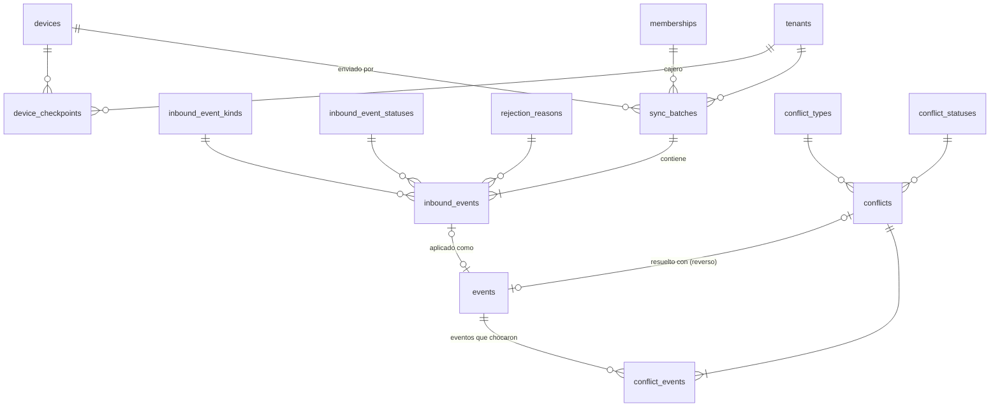

# 5. Sincronización offline (`sync`)

El celular del cajero trabaja sin internet hasta 7 días (RNF-CON-01). Este módulo recibe lo que el celular guardó, garantiza que nada se pierda ni se duplique, y guarda los conflictos para que el propietario decida.

DDL: [11_sync.sql](sql/11_sync.sql) · Decisión: [ADR-0004](../adr/0004-offline-first-outbox-uuid-v7.md)

## Tablas

| Tabla | Qué guarda | Reglas clave |
| --- | --- | --- |
| `sync_batches` | Lote enviado por un celular: cajero, dispositivo, cantidad de eventos. | El id lo genera el celular; reenviar el lote no duplica. |
| `inbound_events` | **Registro de idempotencia.** Cada evento recibido con su id de origen, tipo, estado, hora real, carga cruda (`jsonb`) y hash. | PK = UUID v7 del celular. Un reintento choca con la PK y la API responde "ya aplicado" con el resultado guardado (HU-07-03). Estados: recibido → aplicado / aplicado con conflicto / rechazado (con motivo). La carga cruda se vacía a los 90 días; el hash queda. |
| `device_checkpoints` | Hasta qué `sync_version` bajó cada celular, cuándo subió y cuántos pendientes reportó. | Alimenta el indicador de pendientes y la alerta de más de 24 h (HU-07-05). |
| `conflicts` | Conflicto detectado: tipo, estado, quién lo resolvió, nota y evento de resolución. | Tipos: doble consumo en el mismo horario, saldo negativo, consumo con tiquetera vencida, consumo con QR revocado. El propietario acepta o reversa; reversar crea un `CONSUMPTION_REVERSAL` (HU-07-04). |
| `conflict_events` | Intermedia conflicto ↔ eventos que chocaron. | Un conflicto puede involucrar dos o más eventos. |

## Subida (celular → servidor)

1. El celular envía un lote con eventos ordenados por hora real.
2. Por cada evento, en una transacción: insertar en `inbound_events` (si la PK ya existe, se devuelve el resultado anterior y se sigue con el siguiente).
3. Validar firma del QR, comercio, permisos y estado de la suscripción. Si falla, `REJECTED` con motivo.
4. Crear el evento del libro con **el mismo id** (`ledger.events.id = inbound_events.id`) y `event_origin = OFFLINE_SYNC`, sus subtipos y sus asientos.
5. Revisar reglas que solo se ven al juntar celulares (doble consumo, saldo negativo). Si chocan, `APPLIED_WITH_CONFLICT` + `conflicts`.
6. Encolar la notificación; si `recorded_at - occurred_at` supera `LATE_SYNC_NOTICE_MINUTES`, se usa la plantilla que explica el retraso (RF-OFF-06).

## Bajada (servidor → celular)

Las tablas que el celular necesita sin internet tienen `sync_version`, un número global creciente que cambia con cada inserción o actualización: `people` (de clientes afiliados), `affiliations`, `affiliation_qr_codes` (incluidas las revocadas), `package_types`, `packages`, `consumption_units`, `services`, `service_schedules` y `tenant_signing_keys`.

El celular pide "todo lo de mi comercio con `sync_version` mayor que N" y guarda el nuevo N en `device_checkpoints`. Como nada se borra, no hacen falta lápidas: una revocación o un cambio de estado es una actualización más. Eso mantiene el consumo de datos por debajo de 20 MB al mes (RNF-CON-02).
