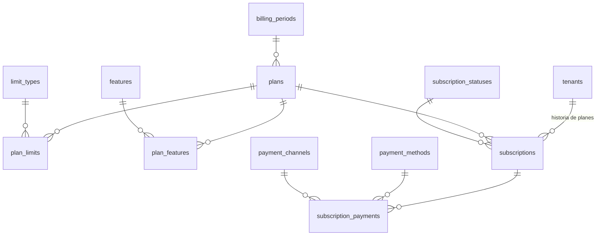

# 6. Suscripciones (`billing`)

Lo que cada comercio paga a VECI. Los límites y funciones de cada plan son filas, así que crear un plan nuevo, subir un límite o mover una función de plan no exige migración ni despliegue.

DDL: [12_billing.sql](sql/12_billing.sql)

## Tablas

| Tabla | Qué guarda | Reglas clave |
| --- | --- | --- |
| `plans` | Prueba, Básico, Pro: precio, periodo, días de prueba y días de gracia. | Sembrados: Prueba 30 días, Básico $35.000, Pro $65.000 (RF-SUS-01). |
| `limit_types` y `plan_limits` | Qué se limita (clientes activos, cajeros, sedes) y cuánto por plan. | `max_value` nulo = ilimitado. Sembrado según HU-11-01. Un límite nuevo es una fila, no una columna. |
| `features` y `plan_features` | Funciones por plan: multisede, exportar, WhatsApp, resumen diario. | "Solo en plan Pro" se consulta aquí, no en un `if` del código. |
| `subscriptions` | Suscripción del comercio: plan, estado, inicio, fin del periodo, fin de la gracia. | Una sola vigente por comercio (`ended_at IS NULL`). Cambiar de plan cierra la fila y abre otra. |
| `subscription_payments` | Pago manual registrado por VECI: fecha, valor, medio, canal, referencia y periodo pagado (RF-SUS-02). | Inmutable. |

## Estados (RF-SUS-03, HU-11-03)

`TRIAL` → `ACTIVE` → `GRACE` (7 días, configurable por plan) → `READ_ONLY` → (pago) `ACTIVE`. Cualquier estado puede pasar a `CANCELLED`. `allows_writes` decide si el comercio puede vender y registrar consumos; en `READ_ONLY` ve todo pero no opera. Ningún estado borra datos.

## Seguridad

El comercio puede leer su suscripción y sus pagos, pero no escribirlos: las políticas RLS de estas tablas son de solo lectura para `veci_app` y la aplicación no tiene permiso `INSERT`/`UPDATE` sobre ellas. Solo la consola VECI (`veci_platform`) las modifica.
