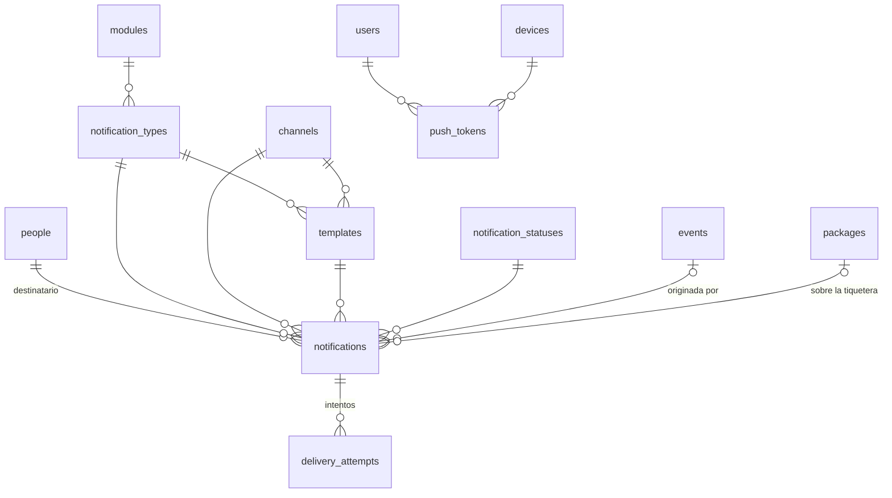

# 7. Notificaciones (`notifications`)

Avisos al cliente y al propietario. Los textos con el tono VECI viven en plantillas versionadas: cambiar "¡Listo, veci!" no requiere desplegar código.

DDL: [13_notifications.sql](sql/13_notifications.sql)

## Tablas

| Tabla | Qué guarda | Reglas clave |
| --- | --- | --- |
| `channels` | Push (activo); WhatsApp, SMS y correo (inactivos, a futuro). | Activar WhatsApp es cambiar `is_enabled`. |
| `notification_types` | Compra, consumo, consumo tardío, reverso, renovación, resumen diario, suscripción en gracia. | Agrupados por módulo. |
| `templates` | Título y cuerpo con variables (`{{tenant}}`, `{{balance}}`, `{{occurred_time}}`), por tipo, canal, idioma y versión. | Una sola activa por tipo, canal e idioma. La de consumo tardío dice la hora real y el motivo (RF-OFF-06). |
| `push_tokens` | Token de Firebase Cloud Messaging por usuario y dispositivo. | Uno vigente por token; se revoca cuando FCM lo invalida. |
| `notifications` | Bandeja de envío (*outbox*): destinatario, tipo, canal, plantilla, evento de origen, tiquetera, variables y estado. | El destinatario es una **persona**, no un usuario, para poder avisar por WhatsApp a quien no tiene app. Índice único: el aviso de renovación sale una vez por tiquetera y canal (HU-09-03). |
| `delivery_attempts` | Cada intento con éxito o error del proveedor. | Permite reintentos y diagnóstico (HU-09-01). |

## Cómo se envía

El caso de uso que registra un consumo inserta la notificación `PENDING` **en la misma transacción** del evento. Un proceso la toma, la envía y la pasa a `SENT` o `FAILED` (que puede volver a `PENDING` para reintentar). Así nunca se notifica un consumo que no quedó guardado, ni se pierde el aviso de uno que sí.
