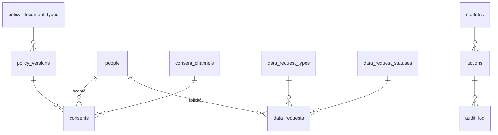

# 8. Cumplimiento y auditoría (`compliance`, `audit`)

Ley 1581 de 2012 (habeas data) y bitácora inmutable de quién hizo qué.

DDL: [14_compliance_audit.sql](sql/14_compliance_audit.sql) · Decisión: [ADR-0010](../adr/0010-auditoria-y-particionamiento.md)

## Protección de datos

| Tabla | Qué guarda | Reglas clave |
| --- | --- | --- |
| `policy_versions` | Versiones publicadas de la política de tratamiento de datos y de los términos: URL, hash del contenido, fecha. | Si una versión nueva marca `requires_reacceptance`, la app pide aceptar de nuevo (HU-12-01). |
| `consents` | Quién aceptó qué versión, cuándo, por qué canal (app, cajero, web), y quién la capturó. | Única por persona y versión (RF-CLI-05). |
| `data_request_types` | Consulta, corrección, supresión, revocación de la autorización. | El plazo legal en días hábiles (10 o 15) está en la tabla. |
| `data_requests` | Solicitud, estado, fecha límite y respuesta. | `due_on` se calcula en días hábiles con `core.holidays` (HU-12-02). |

**Supresión.** Eliminar los datos de una persona no borra filas: pasa a `ANONYMIZED`, sus nombres y documento se reemplazan, sus contactos e identificadores se revocan y sus QR se revocan con motivo `PERSON_ANONYMIZED`. Los eventos y movimientos se conservan sin datos personales, porque son registros contables del comercio.

## Bitácora de auditoría

| Tabla | Qué guarda | Reglas clave |
| --- | --- | --- |
| `audit.actions` | Acciones auditables por módulo (venta, consumo, ajuste, cambio de rol, PIN restablecido, bloqueo de cuenta...). | `is_sensitive` marca las que se revisan en soporte. |
| `audit.audit_log` | Acción, comercio, actor, entidad, dispositivo, IP, id de petición y datos antes y después. | Particionada por mes. Inmutable por trigger y sin permiso `UPDATE`/`DELETE`. Sin FK a tablas de negocio para que nada impida conservarla (RNF-SEG-05, HU-12-03). |

Los eventos del libro ya son su propia auditoría (quién, cuándo, dónde, por qué); `audit_log` cubre además lo que no es un evento de saldo: permisos, accesos, configuraciones y datos personales.
