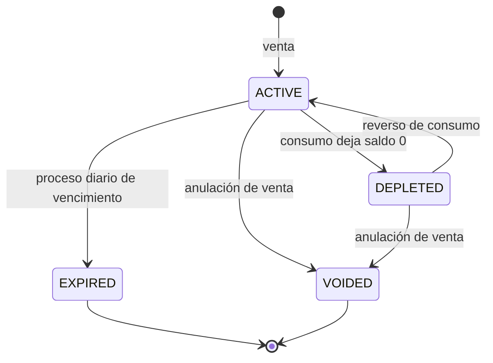

# 9. Catálogos y estados

Ningún estado ni tipo de VECI está escrito en el código como `enum`, constante mágica o `CHECK (estado IN (...))`. Cada uno es una tabla, y las reglas que dependen de él son columnas de esa tabla. Decisión completa en [ADR-0006](../adr/0006-estados-y-tipos-como-catalogos.md).

## 9.1 Forma de un catálogo

```sql
CREATE TABLE prepaid.package_statuses (
  id                  smallint PRIMARY KEY,              -- estable, sembrado por migración
  code                core.catalog_code NOT NULL UNIQUE, -- 'ACTIVE': lo que usa el código
  name                varchar(80) NOT NULL,              -- 'Activa': lo que ve la persona
  allows_consumption  boolean NOT NULL,                  -- regla de negocio en datos
  counts_as_liability boolean NOT NULL,                  -- regla de reportes en datos
  is_initial          boolean NOT NULL DEFAULT false,
  is_terminal         boolean NOT NULL DEFAULT false,
  sort_order          smallint NOT NULL DEFAULT 0
);

CREATE TABLE prepaid.package_status_transitions (     -- la máquina de estados, en datos
  from_status_id smallint REFERENCES prepaid.package_statuses (id),
  to_status_id   smallint REFERENCES prepaid.package_statuses (id),
  PRIMARY KEY (from_status_id, to_status_id)
);
```

El trigger genérico `core.enforce_status_transition` rechaza cualquier `UPDATE` cuyo par (estado anterior, estado nuevo) no esté en la tabla de transiciones, y registra `status_changed_at`.

**Por qué un catálogo por entidad y no una sola tabla `statuses` con columna "dominio".** Con una tabla única, una tiquetera podría quedar con el estado "Suspendido" de una membresía y ninguna llave foránea lo impediría. Un catálogo por entidad mantiene la integridad referencial completa y permite columnas de regla propias (`allows_consumption` no tiene sentido para una membresía).

**En el código.** El dominio usa el `code` (`PackageStatus.ACTIVE = 'ACTIVE'`) y lee las reglas (`allowsConsumption`) del catálogo cargado al iniciar la API y en la copia local del celular. Nunca usa el `id` numérico.

## 9.2 Máquinas de estado

| Entidad | Estados | Transiciones permitidas | Columnas de regla |
| --- | --- | --- | --- |
| Persona | Activa, Anonimizada | Activa → Anonimizada | — |
| Usuario | Pendiente de activar, Activo, Suspendido, Cerrado | Pendiente → Activo / Cerrado; Activo ⇄ Suspendido; Activo / Suspendido → Cerrado | `allows_login` |
| Comercio | En configuración, Activo, Suspendido, Cerrado | Configuración → Activo / Cerrado; Activo ⇄ Suspendido; Activo / Suspendido → Cerrado | `allows_operations` |
| Sede | Activa, Inactiva, Cerrada | Activa ⇄ Inactiva; Activa / Inactiva → Cerrada | `allows_operations` |
| Membresía | Invitado, Activo, Suspendido, Retirado | Invitado → Activo / Retirado; Activo ⇄ Suspendido; Activo / Suspendido → Retirado | `allows_login` |
| Afiliación | Activa, Bloqueada, Retirada | Activa ⇄ Bloqueada; Activa / Bloqueada → Retirada | `allows_operations` |
| Tipo de tiquetera | Activo, Inactivo, Archivado | Activo ⇄ Inactivo; Inactivo → Archivado | `allows_sale` |
| Tiquetera | Activa, Agotada, Vencida, Anulada | Activa ⇄ Agotada; Activa → Vencida; Activa / Agotada → Anulada | `allows_consumption`, `counts_as_liability` |
| Venta | Completada, Anulada | Completada → Anulada | `counts_as_revenue` |
| Evento recibido | Recibido, Aplicado, Aplicado con conflicto, Rechazado | Recibido → cualquiera de los otros tres | `is_terminal` |
| Conflicto | Abierto, Aceptado, Reversado | Abierto → Aceptado / Reversado | — |
| Suscripción | Prueba, Activa, En gracia, Solo lectura, Cancelada | Prueba → Activa / Solo lectura; Activa ⇄ En gracia; En gracia → Solo lectura; Solo lectura → Activa; todas → Cancelada | `allows_writes` |
| Notificación | Pendiente, Enviada, Falló, Cancelada | Pendiente → Enviada / Falló / Cancelada; Falló → Pendiente / Cancelada | `is_terminal` |
| Solicitud de datos | Radicada, En trámite, Resuelta, Rechazada | Radicada → En trámite / Rechazada; En trámite → Resuelta / Rechazada | — |

Ejemplo del ciclo de la tiquetera:



## 9.3 Otros catálogos (tipos y motivos)

| Módulo | Catálogos |
| --- | --- |
| core | `modules`, `currencies`, `countries`, `departments`, `municipalities`, `holidays`, `document_types`, `contact_types`, `weekdays`, `data_types`, `payment_methods`, `payment_channels`, `qr_revocation_reasons` |
| identity | `credential_types`, `credential_revocation_reasons`, `login_failure_reasons`, `session_revocation_reasons`, `device_platforms`, `roles`, `permissions` |
| tenancy | `business_types`, `setting_definitions` |
| customers | `affiliation_channels` |
| prepaid | `consumption_units` (globales y por comercio) |
| ledger | `event_types`, `event_origins`, `event_reasons` |
| consumptions | `capture_methods` |
| sync | `inbound_event_kinds`, `rejection_reasons`, `conflict_types` |
| billing | `billing_periods`, `limit_types`, `features`, `plans` |
| notifications | `channels`, `notification_types`, `templates` |
| compliance | `policy_document_types`, `consent_channels`, `data_request_types` |
| audit | `actions` |

Los valores iniciales están en [20_semillas_catalogos.sql](sql/20_semillas_catalogos.sql) y [21_semillas_seguridad_planes.sql](sql/21_semillas_seguridad_planes.sql). Agregar un valor es una migración de datos revisada en PR, igual que un cambio de esquema.
