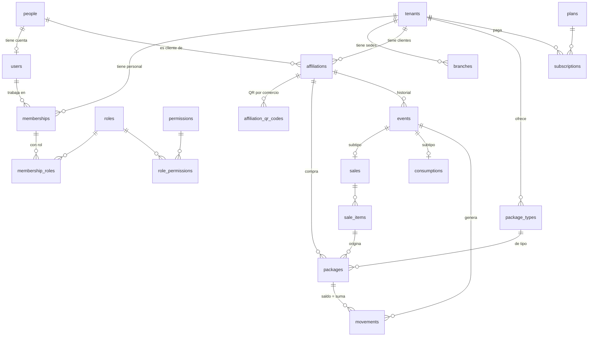

# Modelo de datos de VECI

Versión 1.0 · 4 de octubre de 2026 · HU-00-03

La base de datos es la columna vertebral de VECI: guarda el dinero que los clientes ya pagaron y las comidas que el comercio les debe. Por eso el modelo se diseñó para tres cosas que no se negocian: **que un saldo nunca quede mal**, **que un comercio nunca vea datos de otro** y **que crecer a cafeterías, panaderías o colegios no obligue a rediseñarlo**.

## 1. Principios de diseño

| # | Principio | Cómo se cumple |
| --- | --- | --- |
| 1 | **Normalización a 3FN/FNBC** | Cada hecho vive en un solo lugar. Las únicas copias son deliberadas y están documentadas (sección 5). |
| 2 | **Estados y tipos en tablas, no en código** | 14 catálogos de estado con su tabla de transiciones permitidas, validadas por la base de datos. Ningún `enum` ni `CHECK (estado IN (...))`. Ver [catálogos y estados](09-catalogos-y-estados.md) y [ADR-0006](../adr/0006-estados-y-tipos-como-catalogos.md). |
| 3 | **Persona ≠ usuario ≠ rol** | `people` (quién es), `users` (cuenta para entrar), `roles` y `permissions` (qué puede hacer), unidos por tablas intermedias con vigencia. Ver [ADR-0007](../adr/0007-persona-usuario-rol-membresia.md). |
| 4 | **Libro de eventos inmutable** | Ventas, consumos, reversos y ajustes son eventos que no se editan ni se borran; el saldo es la suma del libro. Ver [ADR-0003](../adr/0003-saldos-como-libro-de-eventos.md). |
| 5 | **Aislamiento multi-comercio en la base** | `tenant_id` en toda tabla de negocio, Row Level Security y llaves foráneas compuestas `(tenant_id, id)` que impiden mezclar comercios incluso por error de código. Ver [ADR-0002](../adr/0002-multi-comercio-con-rls.md). |
| 6 | **Offline primero** | Los ids son UUID v7 generados en el celular; el mismo id es la llave de idempotencia al sincronizar. Ver [ADR-0004](../adr/0004-offline-first-outbox-uuid-v7.md). |
| 7 | **Núcleo genérico** | Comercio + cliente + paquete prepagado + consumo. "Almuerzo" es un dato (`consumption_units`), no una columna. Ver [ADR-0009](../adr/0009-nucleo-generico-multisector.md). |
| 8 | **Nada se borra** | La aplicación no tiene permiso `DELETE` en ninguna tabla. Se cambia un estado, se cierra una vigencia o se registra un evento de corrección. |

## 2. Mapa de módulos (esquemas de PostgreSQL)

Cada módulo del backend NestJS tiene su propio esquema, con sus tablas, catálogos y reglas. Un módulo solo referencia a otro por llave foránea, nunca por lógica compartida ([ADR-0008](../adr/0008-esquemas-por-modulo-y-convenciones.md)).

| Esquema | Módulo NestJS | Responsabilidad | Tablas | Documento |
| --- | --- | --- | --- | --- |
| `core` | shared | Catálogos comunes: monedas, municipios (DIVIPOLA), tipos de documento y de contacto, medios y canales de pago, festivos. | 13 | [convenciones](00-convenciones.md) |
| `identity` | auth | Personas, usuarios, credenciales, roles, permisos, dispositivos y sesiones. | 21 | [identidad y acceso](01-identidad-y-acceso.md) |
| `tenancy` | comercios | Comercios, sedes, membresías del personal, horarios de servicio, ajustes y claves de firma. | 19 | [comercios y sedes](02-comercios-y-sedes.md) |
| `customers` | clientes | Afiliación cliente-comercio, QR personal, QR por comercio y enlace de saldo. | 7 | [clientes y afiliación](03-clientes-y-afiliacion.md) |
| `prepaid` | tiqueteras | Unidades de consumo, tipos de tiquetera y tiqueteras vendidas. | 7 | [tiqueteras, ventas y consumos](04-tiqueteras-ventas-y-consumos.md) |
| `ledger` | tiqueteras / consumos | Libro inmutable: eventos y movimientos de unidades. | 5 | ídem |
| `sales` | tiqueteras | Ventas, líneas, pagos y cierre de caja. | 6 | ídem |
| `consumptions` | consumos | Detalle del consumo y autorizaciones de consumo adicional. | 3 | ídem |
| `sync` | sincronizacion | Lotes, registro de idempotencia, puntos de control y conflictos. | 12 | [sincronización offline](05-sincronizacion-offline.md) |
| `billing` | suscripciones | Planes, límites, funciones, suscripciones y pagos a VECI. | 10 | [suscripciones](06-suscripciones.md) |
| `notifications` | notificaciones | Canales, plantillas versionadas, tokens push y bandeja de envío. | 8 | [notificaciones](07-notificaciones.md) |
| `compliance` | cumplimiento | Políticas de datos, autorizaciones y solicitudes de habeas data. | 8 | [cumplimiento y auditoría](08-cumplimiento-y-auditoria.md) |
| `audit` | shared | Bitácora inmutable particionada por mes. | 2 | ídem |

**Total: 121 tablas**, de las cuales 71 son catálogos y tablas de referencia (estados, transiciones, tipos, motivos, planes, municipios) que se cargan por migración y casi nunca cambian. Las tablas que crecen con el uso son unas 15 y están identificadas en [escalabilidad y rendimiento](10-escalabilidad-y-rendimiento.md).

## 3. Vista general

El diagrama muestra solo las entidades núcleo y cómo se relacionan; cada documento de módulo tiene su diagrama completo.



## 4. Correspondencia con el backlog

HU-00-03 y HU-01-04 nombran las entidades en español; en la base se llaman así ([ADR-0008](../adr/0008-esquemas-por-modulo-y-convenciones.md) explica por qué en inglés):

| Entidad del backlog | Tabla(s) |
| --- | --- |
| Comercio | `tenancy.tenants` |
| Sede | `tenancy.branches` |
| Usuario | `identity.people` (persona) + `identity.users` (cuenta) |
| Rol / permiso | `identity.roles`, `identity.permissions`, `identity.role_permissions` |
| Membresía | `tenancy.memberships` + `tenancy.membership_roles` + `tenancy.membership_branches` |
| Afiliación (cliente-comercio) | `customers.affiliations` + `customers.affiliation_qr_codes` |
| TipoTiquetera | `prepaid.package_types` (+ `prepaid.consumption_units`) |
| Tiquetera | `prepaid.packages` |
| Movimiento | `ledger.events` (el hecho) + `ledger.movements` (el asiento por tiquetera) |
| HorarioServicio | `tenancy.services` + `tenancy.service_schedules` |
| Suscripción | `billing.subscriptions` (+ planes, límites y pagos) |
| Auditoría | `audit.audit_log` |

## 5. Copias deliberadas (desnormalización controlada)

| Dato copiado | Dónde | Por qué | Cómo se mantiene correcto |
| --- | --- | --- | --- |
| Saldo de la tiquetera | `prepaid.packages.units_balance` | Escanear debe responder en menos de 2 s sin sumar todo el historial. | Lo actualiza un trigger en la misma transacción del movimiento; la vista `v_package_balance_check` concilia libro y caché. |
| Saldo tras el asiento | `ledger.movements.balance_after` | El historial muestra el saldo resultante (RF-CON-02). | Lo calcula el mismo trigger; es inmutable. |
| Precio cobrado | `sales.sale_items.unit_price` | Es un hecho histórico: cambiar el precio del tipo no cambia lo vendido. | Inmutable. |
| Fecha de negocio del consumo | `consumptions.consumptions.business_date` | La regla "un consumo por horario" se evalúa en la fecha local del comercio, aunque luego cambie su zona horaria. | Inmutable. |

## 6. DDL de referencia y validación

El modelo completo está en [sql/](sql/README.md), dividido por módulo. No es todavía la migración de producción (esa la crea HU-01-03 con Prisma), pero es su fuente: se ejecuta tal cual en PostgreSQL 16 y una prueba de humo comprueba 36 reglas, entre ellas aislamiento entre comercios, idempotencia, inmutabilidad del libro, transiciones de estado y saldos.

```bash
docs/arquitectura/modelo-datos/sql/validar.sh
```

## 7. Índice

0. [Convenciones](00-convenciones.md)
1. [Identidad y acceso](01-identidad-y-acceso.md)
2. [Comercios y sedes](02-comercios-y-sedes.md)
3. [Clientes y afiliación](03-clientes-y-afiliacion.md)
4. [Tiqueteras, ventas y consumos](04-tiqueteras-ventas-y-consumos.md)
5. [Sincronización offline](05-sincronizacion-offline.md)
6. [Suscripciones](06-suscripciones.md)
7. [Notificaciones](07-notificaciones.md)
8. [Cumplimiento y auditoría](08-cumplimiento-y-auditoria.md)
9. [Catálogos y estados](09-catalogos-y-estados.md)
10. [Escalabilidad y rendimiento](10-escalabilidad-y-rendimiento.md)
11. [Extensiones futuras](11-extensiones-futuras.md)
