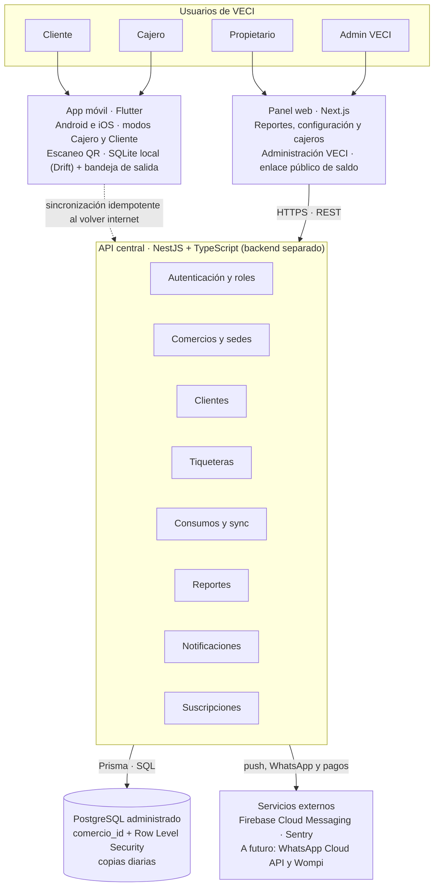

# VECI · Documento de Requerimientos y Recomendaciones Tecnológicas

Versión 1.3 · 4 de octubre de 2026 · Ing. Yadir

VECI es una plataforma SaaS web y móvil que digitaliza la tiquetera prepagada de los restaurantes con un código QR por cliente, y que se presenta como un "veci" (un vecino aliado), no como un software más. Este documento fija qué debe hacer la primera versión (MVP), con qué calidad, y qué tecnologías conviene usar para un emprendimiento de una persona en Mocoa, Putumayo.

## 1. Introducción

### 1.1 Propósito

Servir de base contractual y técnica para diseñar, construir y probar el MVP de VECI. Está dirigido al fundador (desarrollador, dueño del producto), a futuros colaboradores y a aliados o jurados que evalúen el proyecto.

### 1.2 Alcance

- **Incluido en el MVP (fase 1):** restaurantes de menú diario. Registro de clientes, venta de tiqueteras, escaneo QR con descuento de saldo, modo sin conexión, panel del dueño, consulta de saldo del cliente, avisos de renovación y suscripción del restaurante.
- **Fuera del MVP:** facturación electrónica DIAN, pasarela de pago en línea integrada, inventarios completos, domicilios y módulos para tiendas, panaderías o colegios. Quedan previstos en la arquitectura para fases posteriores.

### 1.3 Visión del producto

"Tu tiquetera, sin papel y sin pérdidas." VECI empieza en la comida y luego se expande a cualquier negocio con consumos prepagados o clientes fijos: cafeterías, panaderías, tiendas de barrio, colegios, gimnasios. Por eso el núcleo se diseña como **comercio + cliente + paquete prepagado + consumo**, y no atado a la palabra "restaurante".

### 1.4 Glosario

| Término | Significado en VECI |
| --- | --- |
| Comercio (tenant) | Negocio suscrito a VECI: restaurante, cafetería, panadería, etc. Cada uno ve solo sus datos. |
| Sede | Punto físico de un comercio. Un comercio puede tener varias (plan Pro). |
| Tiquetera | Paquete prepagado de consumos (ej. 30 almuerzos) con precio y vigencia. |
| Consumo | Evento inmutable que descuenta unidades de una tiquetera, con fecha, hora, sede y cajero. |
| Horario de servicio | Horario en que el comercio atiende cada servicio (desayuno, almuerzo, cena); lo usa el control antifraude. |
| QR personal | Código que la app genera al registrarse el cliente. Sirve para que un negocio lo encuentre rápido y lo asocie. |
| QR del cliente en un comercio | Token único y firmado que el sistema asigna al asociar al cliente con un comercio; se usa para registrar consumos y no guarda saldo. Un cliente asociado a 3 comercios tiene 3 QR distintos. |
| PIN | Clave numérica de 6 dígitos para iniciar sesión. |
| Propietario | Dueño o administrador del comercio. |
| Cajero | Empleado que vende tiqueteras y registra consumos. |
| Cliente | Persona que compra tiqueteras. Se registra por sí misma en la app y puede estar en varios comercios. |
| MVP | Producto mínimo viable para el piloto con 5 restaurantes. |

## 2. Descripción general

### 2.1 Contexto y problema

Los restaurantes de "corrientazo" en Mocoa venden tiqueteras de 20, 30 o 60 almuerzos y las controlan en cuaderno o Excel. Eso produce consumos sin anotar en hora pico, disputas con el cliente sobre el saldo y un dueño que no sabe cuánto dinero tiene comprometido en comidas por servir. Perder 2 almuerzos de $12.000 por semana equivale a cerca de $100.000 al mes, más que la suscripción propuesta.

### 2.2 Actores

| Actor | Qué necesita de VECI | Dispositivo principal |
| --- | --- | --- |
| Propietario | Configurar su negocio, ver dinero comprometido, renovaciones y clientes inactivos, gestionar cajeros y su suscripción. | Panel web (PC o celular) |
| Cajero | Registrar clientes, vender tiqueteras y escanear QR en segundos, incluso sin internet. | App móvil (celular del negocio) |
| Cliente (comensal) | Ver su QR y su saldo en cada comercio, recibir avisos de renovación. | App móvil o enlace por WhatsApp |
| Administrador VECI | Dar de alta comercios, gestionar planes y cobros, dar soporte. | Panel web (rol interno) |

### 2.3 Supuestos

- El comercio usa el celular que ya tiene como lector QR; no se compra hardware.
- Muchos celulares son Android de gama baja (2 a 3 GB de RAM, Android 8 o superior).
- El internet en Mocoa y municipios cercanos es intermitente; el registro de consumos no puede depender de él.
- WhatsApp es el canal de comunicación natural de clientes y dueños.
- El fundador desarrolla solo, con presupuesto inicial limitado (inversión total estimada en $5.600.000 y gastos operativos de unos $600.000 al mes).

### 2.4 Restricciones

- Cumplimiento de la Ley 1581 de 2012 (habeas data) y el Decreto 1377 de 2013: autorización expresa del cliente y política de tratamiento de datos publicada.
- Precio objetivo de $35.000 a $65.000 mensuales por comercio: la infraestructura debe costar una fracción de eso por cliente.
- Interfaz en español colombiano, tono cercano, pensada para personas con poca experiencia digital.
- El piloto (5 restaurantes, 2 meses) debe estar listo antes de invertir en funciones avanzadas.

## 3. Requerimientos funcionales

Prioridad: **Debe** = imprescindible para el piloto; **Debería** = antes del lanzamiento comercial; **Podría** = fases posteriores. Cada requerimiento tiene un ID estable para trazarlo en tareas, pruebas y PR.

### 3.1 Autenticación, usuarios y roles (AUT)

| ID | Requerimiento | Prioridad |
| --- | --- | --- |
| RF-AUT-01 | El sistema permite iniciar sesión con número de celular y un PIN de 6 dígitos. El PIN se guarda cifrado; si se olvida, lo restablece el propietario (cajeros) o soporte VECI (clientes). | Debe |
| RF-AUT-02 | El propietario y el cajero pueden usar también correo y contraseña en el panel web. | Debe |
| RF-AUT-03 | Existen los roles Administrador VECI, Propietario, Cajero y Cliente; cada acción verifica rol y comercio. | Debe |
| RF-AUT-04 | Un mismo usuario puede tener roles distintos en comercios distintos (cliente en uno, cajero en otro). | Debe |
| RF-AUT-05 | El propietario invita, suspende y retira cajeros de su comercio. | Debe |
| RF-AUT-06 | La sesión del cajero en la app permanece abierta en el dispositivo del negocio y se puede cerrar a distancia desde el panel. | Debería |

### 3.2 Comercios y sedes (COM)

| ID | Requerimiento | Prioridad |
| --- | --- | --- |
| RF-COM-01 | El administrador o el propio dueño registra un comercio con nombre, NIT o cédula, tipo de negocio, logo y datos de contacto. | Debe |
| RF-COM-02 | El comercio define sus horarios de servicio (ej. almuerzo de 11:30 a 15:00). | Debe |
| RF-COM-03 | El comercio puede tener varias sedes, cada una con sus cajeros y consumos. | Debería |
| RF-COM-04 | El tipo de negocio (restaurante, cafetería, panadería, colegio, tienda) es un dato configurable, no código distinto. | Debe |

### 3.3 Clientes (CLI)

| ID | Requerimiento | Prioridad |
| --- | --- | --- |
| RF-CLI-01 | El cliente se registra por sí mismo en la app con nombre, número de celular, número de documento y un PIN de 6 dígitos. | Debe |
| RF-CLI-02 | Al registrarse, la app le genera un QR personal. Para afiliarse a un negocio, el cliente lo muestra; el cajero lo escanea, el sistema encuentra al cliente al instante y lo asocia a ese negocio. | Debe |
| RF-CLI-03 | Al asociarlo, el sistema asigna al cliente un QR único para ese negocio, distinto del de cualquier otro negocio al que pertenezca (ver RF-CON-01). | Debe |
| RF-CLI-04 | Si el cliente no tiene la app, el cajero lo registra con nombre, celular y documento en menos de 30 segundos. | Debe |
| RF-CLI-05 | Al registrarse, el cliente acepta la política de tratamiento de datos y queda guardada la fecha y versión aceptada. | Debe |
| RF-CLI-06 | Un mismo cliente (identificado por celular y documento) puede estar en varios negocios sin duplicarse; cada negocio ve solo sus propios datos del cliente. | Debe |
| RF-CLI-07 | Se puede buscar un cliente por nombre, celular, documento o escaneando su QR. | Debe |
| RF-CLI-08 | El cliente puede solicitar ver, corregir o eliminar sus datos (derechos de habeas data). | Debe |

### 3.4 Tiqueteras (TIQ)

| ID | Requerimiento | Prioridad |
| --- | --- | --- |
| RF-TIQ-01 | El propietario crea tipos de tiquetera con nombre, cantidad de unidades, precio y vigencia en días. | Debe |
| RF-TIQ-02 | El cajero vende una tiquetera a un cliente registrando el medio de pago: efectivo o transferencia (Nequi, Daviplata o Bancolombia). | Debe |
| RF-TIQ-03 | Al vender, la tiquetera queda ligada al QR del cliente en ese comercio y el cliente ve el nuevo saldo en su app. | Debe |
| RF-TIQ-04 | Un cliente puede tener varias tiqueteras activas; el consumo descuenta primero la que vence antes. | Debe |
| RF-TIQ-05 | El sistema marca como vencidas las tiqueteras cuya vigencia terminó y conserva su historial. | Debe |
| RF-TIQ-06 | El propietario puede anular una venta o ajustar un saldo dejando motivo y usuario registrados. | Debe |

### 3.5 Consumos y escaneo QR (CON)

| ID | Requerimiento | Prioridad |
| --- | --- | --- |
| RF-CON-01 | El cajero escanea el QR con la cámara y el sistema descuenta 1 unidad (o la cantidad indicada) en menos de 2 segundos. El QR escaneado es el que el sistema asignó al cliente al asociarlo a ese negocio; en otro negocio el cliente tiene otro QR distinto. | Debe |
| RF-CON-02 | Cada consumo guarda fecha, hora, sede, cajero, dispositivo, unidades y saldo resultante, y no se puede editar ni borrar; una corrección es un nuevo evento de reverso. | Debe |
| RF-CON-03 | Antifraude: un consumo por cliente por horario de servicio, salvo autorización explícita del cajero con motivo. | Debe |
| RF-CON-04 | El QR contiene solo un token firmado; un QR manipulado, de otro comercio o revocado se rechaza con mensaje claro. | Debe |
| RF-CON-05 | Si no hay saldo o la tiquetera venció, la app lo indica y ofrece vender una nueva. | Debe |
| RF-CON-06 | Si el cliente no tiene el celular, el cajero puede registrar el consumo buscando por nombre o cédula. | Debe |

### 3.6 Modo sin conexión (OFF)

| ID | Requerimiento | Prioridad |
| --- | --- | --- |
| RF-OFF-01 | La app del cajero registra consumos y ventas sin internet y los guarda en el dispositivo. | Debe |
| RF-OFF-02 | Al volver la conexión, sincroniza automáticamente en orden y sin duplicados (cada evento lleva un ID único generado en el dispositivo). | Debe |
| RF-OFF-03 | Sin conexión, la app valida el QR y el saldo con la última copia local de clientes y tiqueteras del comercio. | Debe |
| RF-OFF-04 | Si al sincronizar aparece un conflicto (ej. el mismo cliente consumió en dos sedes), el sistema lo registra y lo muestra al propietario para que decida. | Debe |
| RF-OFF-05 | La app muestra cuántos registros faltan por sincronizar y desde cuándo. | Debe |
| RF-OFF-06 | Cuando un consumo registrado sin conexión se sincroniza después, la notificación al cliente explica el retraso para que no resulte extraña. Ejemplo: "\[Negocio\] registró tu consumo de N almuerzos a las \[hora del consumo\]. Te llega ahora porque en ese momento no había internet." | Debe |

### 3.7 Panel del propietario y reportes (REP)

| ID | Requerimiento | Prioridad |
| --- | --- | --- |
| RF-REP-01 | El panel muestra comidas pendientes por servir y dinero comprometido (pasivo) a la fecha. | Debe |
| RF-REP-02 | El panel lista clientes próximos a terminar su tiquetera, vencidos e inactivos (sin consumo en N días). | Debe |
| RF-REP-03 | Muestra ventas e ingresos por día, semana y mes, y por medio de pago. | Debe |
| RF-REP-04 | Historial auditable por cliente: cada compra, consumo, ajuste y quién lo hizo. | Debe |
| RF-REP-05 | Exportar reportes a Excel o PDF. | Debería |
| RF-REP-06 | Cierre de caja diario por cajero. | Debería |

### 3.8 Notificaciones (NOT)

| ID | Requerimiento | Prioridad |
| --- | --- | --- |
| RF-NOT-01 | Si hay internet al registrar el consumo, el cliente recibe de inmediato una notificación push con el negocio, la cantidad descontada y su saldo actualizado. Si no había internet, aplica RF-OFF-06. | Debe |
| RF-NOT-02 | Cuando queden 2 unidades (configurable), el cliente recibe un aviso de renovación. | Debe |
| RF-NOT-03 | Avisos por WhatsApp (saldo bajo, renovación), a futuro. | Podría |
| RF-NOT-04 | El propietario recibe un resumen diario de ventas y consumos. | Podría |

### 3.9 App del cliente (APC)

| ID | Requerimiento | Prioridad |
| --- | --- | --- |
| RF-APC-01 | El cliente ve sus comercios, su QR en cada uno, saldo, vencimiento e historial de consumos. | Debe |
| RF-APC-02 | El QR se puede ver sin internet (guardado en el dispositivo). | Debe |
| RF-APC-03 | El cliente puede consultar su saldo desde un enlace web sin instalar la app. | Debe |
| RF-APC-04 | El cliente puede comprar o renovar una tiquetera desde la app con pago en línea. | Podría |

### 3.10 Suscripción y facturación de VECI (SUS)

| ID | Requerimiento | Prioridad |
| --- | --- | --- |
| RF-SUS-01 | Cada comercio tiene un plan (Prueba, Básico, Pro) con límites de clientes activos, cajeros y sedes que el sistema hace cumplir. | Debe |
| RF-SUS-02 | El administrador registra pagos de suscripción manuales (Nequi, transferencia, efectivo) y su vigencia. | Debe |
| RF-SUS-03 | Al vencer la suscripción hay un periodo de gracia; luego el comercio queda en solo lectura, nunca se borran sus datos. | Debe |
| RF-SUS-04 | Cobro automático recurrente mediante pasarela (Wompi u otra). | Podría |

### 3.11 Expansión a otros sectores (EXP)

| ID | Requerimiento | Prioridad |
| --- | --- | --- |
| RF-EXP-01 | Paquetes de productos distintos a comida (cafés, panes, lavadas) usando el mismo modelo de tiquetera. | Podría |
| RF-EXP-02 | Venta de productos sueltos con catálogo e inventario básico (tiendas, panaderías). | Podría |
| RF-EXP-03 | Colegios: acudiente que recarga y consulta los consumos de sus hijos. | Podría |
| RF-EXP-04 | "Fiado" o crédito de tienda de barrio con límite por cliente. | Podría |

## 4. Requerimientos no funcionales

Cada requerimiento tiene una meta medible para verificarla en el piloto.

| ID | Categoría | Requerimiento y meta medible |
| --- | --- | --- |
| RNF-REN-01 | Rendimiento | Registrar un consumo, desde abrir la cámara hasta ver el saldo, toma 3 segundos o menos en un Android de gama baja (2 GB RAM). |
| RNF-REN-02 | Rendimiento | La API responde el 95 % de las peticiones en menos de 500 ms con 50 comercios activos. |
| RNF-REN-03 | Rendimiento | El panel web carga en menos de 3 segundos con conexión 3G. |
| RNF-DIS-01 | Disponibilidad | La API está disponible el 99,5 % del mes. La operación de caja no depende de ella (modo sin conexión). |
| RNF-DIS-02 | Disponibilidad | Copia de seguridad automática diaria de la base de datos, retenida 30 días, con prueba de restauración mensual. |
| RNF-CON-01 | Conectividad | La app opera al menos 7 días sin internet y sincroniza hasta 1.000 eventos pendientes sin pérdida. |
| RNF-CON-02 | Conectividad | La app consume menos de 20 MB de datos móviles al mes en uso normal de un cajero. |
| RNF-SEG-01 | Seguridad | Todo el tráfico usa HTTPS (TLS 1.2 o superior); contraseñas y PIN con hash bcrypt o Argon2. |
| RNF-SEG-02 | Seguridad | Aislamiento multi-comercio: ninguna consulta devuelve datos de otro comercio; se refuerza con Row Level Security en PostgreSQL y pruebas automáticas. |
| RNF-SEG-03 | Seguridad | Los tokens QR están firmados (HMAC o firma asimétrica) y se pueden revocar. |
| RNF-SEG-04 | Seguridad | Tokens de sesión de corta duración (15 min) con renovación; bloqueo temporal tras 5 intentos fallidos de PIN. |
| RNF-SEG-05 | Seguridad | Bitácora de auditoría inmutable de ventas, consumos, ajustes y cambios de permisos. |
| RNF-LEG-01 | Legal | Cumple la Ley 1581 de 2012: autorización registrada, política de datos visible, atención de consultas y reclamos en los plazos de ley (10 y 15 días hábiles). |
| RNF-LEG-02 | Legal | Se recoge solo el dato necesario: nombre, celular y número de documento. |
| RNF-USA-01 | Usabilidad | Un cajero sin experiencia aprende a vender y escanear en 10 minutos o menos (medido en el piloto). |
| RNF-USA-02 | Usabilidad | Lenguaje cercano y en español colombiano ("¡Listo, veci! Te quedan 12 almuerzos"), botones grandes, alto contraste y textos legibles al sol. |
| RNF-USA-03 | Usabilidad | Satisfacción de dueños y cajeros en el piloto de 4 o más sobre 5. |
| RNF-COM-01 | Compatibilidad | App en Android 8+ e iOS 14+; panel en Chrome, Edge y Safari de los últimos 2 años, usable desde celular. |
| RNF-COM-02 | Compatibilidad | El instalable de Android pesa menos de 25 MB. |
| RNF-ESC-01 | Escalabilidad | La arquitectura soporta 500 comercios y 50.000 clientes sin rediseño, solo aumentando recursos. |
| RNF-ESC-02 | Escalabilidad | Agregar un nuevo tipo de negocio no requiere cambiar el modelo central de datos. |
| RNF-MAN-01 | Mantenibilidad | Código en repositorio con integración continua, pruebas automáticas del núcleo (tiqueteras, consumos, sincronización) con cobertura de 70 % o más. |
| RNF-MAN-02 | Mantenibilidad | Migraciones de base de datos versionadas; despliegue a producción con un solo comando o automático. |
| RNF-MAN-03 | Mantenibilidad | Backend, panel web y app móvil siguen arquitectura limpia: carpetas por funcionalidad, capas con una sola responsabilidad, archivos de 300 líneas como máximo y funciones de 50 líneas como máximo, verificado en CI (ver sección 5.3). |
| RNF-OBS-01 | Observabilidad | Registro centralizado de errores en app, panel y API, con alerta al fundador cuando falle la sincronización o la API. |
| RNF-COS-01 | Costo | La infraestructura cuesta menos de $150.000 COP al mes hasta los 30 comercios. |

## 5. Arquitectura y evaluación del stack propuesto

El stack propuesto (Flutter, Next.js, NestJS y PostgreSQL) es adecuado y se recomienda mantenerlo, con tres ajustes: construir la API como un backend separado en NestJS, organizado por módulos, que consumen tanto la app Flutter como el panel web Next.js, diseñar el **modo sin conexión desde el primer día** y reducir el panel web del MVP a lo que el dueño no puede hacer cómodamente desde el celular.



La app del cajero guarda cada venta y consumo en el celular y los envía a la API cuando hay internet; la API es la única que toca PostgreSQL y los servicios externos.

### 5.1 Evaluación por componente

| Componente | Propuesta | Veredicto | Por qué | Ajuste recomendado |
| --- | --- | --- | --- | --- |
| App móvil | Flutter (Android e iOS) | Mantener | Un solo código para ambas plataformas, buen rendimiento en gama baja, acceso nativo a cámara y base de datos local, ideal para el modo sin conexión. Mejor opción que la PWA del plan de negocio para escanear y trabajar offline. | Una sola app con dos modos (Cajero y Cliente) según el rol, en vez de dos apps. Publicar primero en Android, que domina el mercado local. |
| Panel web | Next.js | Mantener, con alcance reducido | Consume el mismo backend NestJS y comparte TypeScript con él (tipos y validaciones), se despliega gratis en Vercel y sirve el enlace público de saldo del cliente. | En el MVP, solo reportes, configuración, cajeros y administración VECI. La caja vive en la app. |
| API central | NestJS + TypeScript | Mantener | Estructura por módulos que coincide con los de la imagen (autenticación, pedidos, tiqueteras, ventas, inventarios, pagos, notificaciones), inyección de dependencias y pruebas integradas. | Backend separado: un solo servicio desplegable con módulos internos, consumido por la app y el panel. Inventarios y pedidos se dejan para fases posteriores. |
| Base de datos | PostgreSQL central multi-comercio | Mantener | Transacciones fuertes para saldos, JSONB para configuraciones por tipo de negocio y Row Level Security para aislar comercios. | Esquema compartido con columna comercio\_id en cada tabla y RLS activado. Saldos calculados desde eventos de consumo. |

### 5.2 Decisiones de arquitectura clave

1. **Multi-comercio (multi-tenant) en esquema compartido.** Una sola base de datos, cada fila con su comercio\_id, aislamiento por RLS y por un guardia en NestJS. Es lo más barato de operar y escala a cientos de comercios.
2. **Consumos como eventos inmutables.** El saldo de una tiquetera es la suma de sus compras menos sus consumos y reversos. Esto da trazabilidad completa y resuelve disputas.
3. **Offline primero con bandeja de salida (outbox).** La app guarda cada venta o consumo en SQLite local con un ID único (UUID v7) y lo envía a un endpoint de sincronización idempotente; reintentar nunca duplica.
4. **QR sin datos sensibles.** El QR lleva un token firmado (cliente + comercio + versión); la app del cajero puede verificar la firma sin internet.
5. **Modelo genérico para crecer.** Las entidades centrales son Comercio, Cliente, Paquete (tiquetera), Movimiento (compra, consumo, ajuste) y, más adelante, Producto. Un colegio o una panadería reutilizan el mismo núcleo.

### 5.3 Arquitectura limpia (Clean Architecture)

Backend, panel web y app móvil siguen arquitectura limpia: cada parte del sistema se organiza **por funcionalidad** y, dentro de cada funcionalidad, **por capas con una sola responsabilidad**. El objetivo es que VECI pueda crecer a nuevos sectores sin acumular deuda técnica y que cualquier archivo se entienda en pocos minutos.

#### 5.3.1 Reglas que aplican a las tres aplicaciones

1. **Regla de dependencia.** Las dependencias apuntan siempre hacia adentro: presentación e infraestructura dependen de aplicación, y aplicación depende de dominio. El dominio no importa nada del framework (NestJS, Next.js, Flutter), de la base de datos ni de servicios externos.
2. **Cuatro capas por funcionalidad.**

    | Capa | Responsabilidad | Ejemplos en VECI | No puede contener |
    | --- | --- | --- | --- |
    | Dominio | Reglas del negocio puras: entidades, objetos de valor, reglas y contratos (interfaces) de repositorios. | Tiquetera, Movimiento, regla "un consumo por horario de servicio", cálculo de saldo. | Código de framework, SQL, HTTP, UI. |
    | Aplicación | Casos de uso que orquestan el dominio; un caso de uso por acción. | RegistrarConsumo, VenderTiquetera, AfiliarCliente, SincronizarEventos. | Detalles de base de datos o de pantalla. |
    | Infraestructura | Implementaciones técnicas de los contratos. | Repositorios con Prisma o Drift, cliente HTTP, Firebase Cloud Messaging, firma de QR. | Reglas de negocio. |
    | Presentación | Entrada y salida: controladores, páginas, widgets, validación de formato. | Controlador de consumos, pantalla de escaneo, tablero del propietario. | Reglas de negocio o acceso directo a la base de datos. |

3. **Carpetas por funcionalidad, no por tipo de archivo.** Cada módulo (auth, comercios, clientes, tiqueteras, consumos, sincronizacion, notificaciones, reportes, suscripciones) tiene su propia carpeta con sus capas. Lo que comparten varios módulos va en una carpeta `shared` (backend y web) o `core` (mobile).
4. **Una responsabilidad por archivo.** Un archivo contiene una clase, un caso de uso, un componente o un widget principal. El nombre del archivo dice qué hace (`registrar-consumo.use-case.ts`, `scan_page.dart`).
5. **Archivos y funciones cortos.**

    | Elemento | Recomendado | Máximo (CI falla) |
    | --- | --- | --- |
    | Archivo | 200 líneas | 300 líneas |
    | Función o método | 30 líneas | 50 líneas |
    | Parámetros por función | 3 | 5 (usar un objeto) |

    Si un archivo se acerca al máximo, se divide por responsabilidad, no se comprime.
6. **Inyección de dependencias.** Los casos de uso reciben interfaces, nunca implementaciones concretas. Así el dominio y la aplicación se prueban sin base de datos ni red.
7. **Pruebas por capa.** Dominio y aplicación con pruebas unitarias rápidas; infraestructura con pruebas de integración; presentación con pruebas de widgets o componentes en los flujos clave.

#### 5.3.2 Backend (NestJS)

```text
backend/src/
├── main.ts
├── app.module.ts
├── shared/
│   ├── domain/            # Errores base, objetos de valor comunes (Dinero, Celular)
│   ├── application/       # Interfaces comunes (UnitOfWork, Clock, IdGenerator)
│   ├── infrastructure/    # Prisma, configuración, logger, Sentry
│   └── presentation/      # Filtros de error, interceptores, guard de comercio activo
└── modules/
    └── consumos/
        ├── domain/
        │   ├── entities/          # consumo.entity.ts
        │   ├── value-objects/     # unidades.vo.ts
        │   ├── rules/             # un-consumo-por-horario.rule.ts
        │   └── repositories/      # consumo.repository.ts (interfaz)
        ├── application/
        │   ├── use-cases/         # registrar-consumo.use-case.ts, reversar-consumo.use-case.ts
        │   └── dto/               # registrar-consumo.input.ts
        ├── infrastructure/
        │   ├── persistence/       # prisma-consumo.repository.ts, consumo.mapper.ts
        │   └── services/          # verificador-qr.service.ts
        ├── presentation/
        │   └── http/              # consumos.controller.ts, registrar-consumo.request.ts
        └── consumos.module.ts     # Solo conecta las piezas
```

- Los controladores solo validan la petición, llaman a un caso de uso y devuelven la respuesta.
- Prisma solo se usa dentro de `infrastructure/persistence`.
- Un módulo no importa archivos internos de otro módulo; si necesita algo, lo pide por la interfaz que ese módulo exporta.

#### 5.3.3 Panel web (Next.js)

```text
web/src/
├── app/                   # Rutas del App Router: solo componen pantallas, sin lógica
│   ├── (auth)/login/page.tsx
│   └── (panel)/reportes/page.tsx
├── features/
│   └── reportes/
│       ├── domain/        # Tipos y reglas de presentación de datos (dinero comprometido)
│       ├── application/   # Hooks de caso de uso: use-dinero-comprometido.ts
│       ├── infrastructure/# Llamadas al API con el cliente generado desde OpenAPI
│       └── presentation/  # Componentes: dinero-comprometido-card.tsx, ventas-chart.tsx
└── shared/
    ├── ui/                # Componentes base (shadcn/ui) y sistema de diseño VECI
    ├── lib/               # Utilidades: formato de moneda COP, fechas
    └── config/
```

- Las páginas de `app/` no llaman al API directamente: usan los hooks de `application`.
- Los componentes de `presentation` no conocen URLs ni detalles HTTP.

#### 5.3.4 App móvil (Flutter)

```text
mobile/lib/
├── main.dart
├── core/
│   ├── di/                # Proveedores de Riverpod para inyección de dependencias
│   ├── database/          # Drift: base local y migraciones
│   ├── network/           # Cliente HTTP generado, interceptores, sesión
│   ├── sync/              # Bandeja de salida y motor de sincronización
│   ├── router/            # go_router
│   ├── theme/             # Sistema de diseño VECI
│   └── error/             # Fallos y excepciones comunes
└── features/
    └── consumos/
        ├── domain/
        │   ├── entities/      # consumo.dart
        │   ├── repositories/  # consumo_repository.dart (abstracto)
        │   └── usecases/      # registrar_consumo.dart
        ├── data/
        │   ├── datasources/   # consumo_local_datasource.dart, consumo_remote_datasource.dart
        │   ├── models/        # consumo_model.dart (DTO y mapeo)
        │   └── repositories/  # consumo_repository_impl.dart (decide local o remoto)
        └── presentation/
            ├── pages/         # scan_page.dart
            ├── widgets/       # resultado_consumo_card.dart
            └── providers/     # registrar_consumo_controller.dart
```

- Los widgets no llaman a Drift ni al API: usan un controlador de Riverpod que ejecuta un caso de uso.
- El repositorio de `data` decide si guarda en la base local, en la bandeja de salida o en el API; el resto de la app no sabe si hay internet.

#### 5.3.5 Cómo se hace cumplir

- **Linters en CI:** ESLint con `max-lines` y `max-lines-per-function` en backend y web; `dart analyze` con reglas estrictas y un chequeo de longitud de archivos en mobile.
- **Límites entre capas:** dependency-cruiser (o eslint-plugin-boundaries) en backend y web rechaza importaciones que rompan la regla de dependencia; en mobile, un chequeo en CI impide que `domain/` importe Flutter, Drift o paquetes de red.
- **Revisión de PR:** cada PR se revisa contra esta sección antes de fusionarse.

## 6. Recomendaciones tecnológicas

Para una persona sola, la regla es: pocas piezas, servicios administrados y gratis o casi gratis hasta tener 15 comercios pagos (punto de equilibrio del plan de negocio).

### 6.1 Herramientas recomendadas

| Necesidad | Recomendación | Alternativa | Motivo |
| --- | --- | --- | --- |
| Estado y navegación en Flutter | Riverpod + go\_router | Bloc | Menos código repetitivo, fácil de probar. |
| Base local offline | Drift (SQLite) | Isar | SQL tipado, migraciones y consultas reactivas; encaja con PostgreSQL. |
| Escaneo QR | mobile\_scanner | qr\_code\_scanner | Mantenido activamente, rápido en gama baja. |
| ORM de la API | Prisma | Drizzle o TypeORM | Migraciones versionadas y tipado fuerte; curva de aprendizaje baja. |
| Validación y contratos | Zod o class-validator + OpenAPI generado por NestJS | tRPC | Un contrato único del que se genera el cliente Dart y el de Next.js. |
| Autenticación | JWT propio en NestJS + celular y PIN de 6 dígitos (a futuro: OTP por WhatsApp o SMS) | Firebase Auth (teléfono) | Control total de roles por comercio; Firebase acelera si el tiempo apremia. |
| Notificaciones push | Firebase Cloud Messaging | OneSignal | Gratuito y nativo en Android e iOS. |
| WhatsApp | WhatsApp Business Cloud API (Meta), a futuro | Proveedor intermedio (ej. Twilio) | Plantillas de QR, saldo bajo y OTP; se cobra por conversación, solo en plan Pro. |
| Pagos en línea (fase 2) | Wompi (a futuro) | Mercado Pago, ePayco | Colombiano, acepta Nequi, PSE, tarjetas y Bancolombia. |
| Componentes del panel | Tailwind CSS + shadcn/ui + Recharts | MUI | Rápido de construir y liviano. |
| Repositorio | Un repositorio con tres proyectos independientes en la raíz: backend/, web/ y mobile/, más docs/ ([ADR 0014](arquitectura/adr/0014-proyectos-independientes-backend-web-mobile.md)) | Monorepo con paquetes compartidos; repos separados | Un solo lugar para issues, documentación y CI, sin acoplar los proyectos entre sí. |
| Integración continua | GitHub Actions | GitLab CI | Ya se usa GitHub; gratis para repos privados en cuota básica. |
| Errores y monitoreo | Sentry (plan gratuito) | Firebase Crashlytics | Cubre Flutter, Next.js y NestJS en un solo panel. |

### 6.2 Infraestructura y costos aproximados

Cifras aproximadas en dólares, sin consultar tarifas vigentes; deben verificarse antes de contratar.

| Componente | Servicio sugerido | Piloto (5 comercios) | Hasta 30 comercios |
| --- | --- | --- | --- |
| API NestJS | Railway, Render o Fly.io (región EE. UU. Este) | US$0 a 5/mes | US$10 a 20/mes |
| PostgreSQL | Neon o Supabase administrado, con copias diarias | US$0 (capa gratuita) | US$19 a 25/mes |
| Panel Next.js | Vercel | US$0 | US$0 a 20/mes |
| Push y errores | FCM + Sentry | US$0 | US$0 |
| WhatsApp | Cloud API de Meta | Centavos por conversación | Depende del volumen del plan Pro |
| Tiendas de apps | Google Play (pago único) y Apple (anual) | US$25 único | + US$99/año al publicar en iOS |
| Dominio | veci.com.co o similar | US$10 a 30/año | igual |

Alternativa más económica a escala: un VPS (Hetzner o DigitalOcean, US$5 a 12/mes) con Docker para API y base de datos, a cambio de administrar uno mismo copias y actualizaciones.

### 6.3 Hoja de ruta por fases

Las fases siguen las etapas del plan de negocio (piloto en Mocoa, consolidación regional y expansión).

| Fase | Periodo | Alcance | Puerta para pasar a la siguiente |
| --- | --- | --- | --- |
| Fase 0 · Validar | Meses 1 a 2 | Entrevistas a 20 restaurantes, modelo de datos, prototipo en Figma | Problema validado en entrevistas |
| **Fase 1 · Piloto** | Meses 3 a 9 | Requerimientos "Debe", app Android + panel (11 sprints de 2 semanas, meses 3 a 7) y piloto con 5 restaurantes durante 2 meses (meses 8 y 9) | Satisfacción de 4/5 o más y cero errores de saldo |
| Fase 2 · Lanzar | Meses 10 a 15 | Requerimientos "Debería", multisede, publicación en iOS, meta de 30 comercios | 15 comercios pagos (punto de equilibrio) |
| Fase 3 · Expandir | Mes 16 en adelante | Pagos en línea, WhatsApp, cafeterías, panaderías, colegios y tiendas, Puerto Asís y Sibundoy | — |

La Fase 1 se amplió de 4 a 7 meses porque el [backlog](backlog.md) estima 226 puntos de historias "Debe", unas 22 semanas de trabajo a un ritmo realista para una sola persona, más los 2 meses del piloto.

No se pasa a la siguiente fase sin cumplir su puerta: así el esfuerzo de una sola persona va primero a lo que valida el negocio.

### 6.4 Riesgos y mitigación

| Riesgo | Impacto | Mitigación |
| --- | --- | --- |
| Sincronización offline con duplicados o saldos inconsistentes | Alto: destruye la confianza en VECI | Eventos con ID único, endpoint idempotente, pruebas automáticas de conflictos antes del piloto. |
| Fuga de datos entre comercios | Alto: legal y reputacional | RLS en PostgreSQL + guardia de comercio en NestJS + pruebas que intenten leer datos ajenos. |
| Alcance excesivo para un desarrollador solo | Alto: el piloto se retrasa | Construir solo los requerimientos "Debe"; inventarios, pedidos y pagos en línea después. |
| Tres tecnologías para mantener (Dart, Next.js, NestJS) | Medio | TypeScript compartido entre panel y API; cliente Dart generado desde OpenAPI. |
| Baja adopción por desconfianza tecnológica | Medio | Lenguaje cercano, capacitación presencial, soporte por WhatsApp, piloto gratuito. |
| Costos de WhatsApp que crecen con el uso | Medio | Push gratuito por defecto; WhatsApp solo en plan Pro y con plantillas medidas. |
| Pérdida del celular del cajero con datos sin sincronizar | Medio | Indicador de pendientes, sincronización frecuente y cierre de sesión remoto. |

### 6.5 Próximos pasos

- [ ] Validar estos requerimientos en las entrevistas con los 20 restaurantes de Mocoa.
- [ ] Diseñar el modelo de datos (Comercio, Cliente, Paquete, Movimiento) y el contrato OpenAPI.
- [ ] Prototipar en Figma las 5 pantallas clave: escanear, vender, registrar cliente, saldo del cliente y panel.
- [ ] Construir primero el flujo de escaneo offline y su sincronización, que es el mayor riesgo técnico.
- [ ] Redactar la política de tratamiento de datos y el texto de autorización.

## Historial de versiones

| Versión | Fecha | Cambios |
| --- | --- | --- |
| 1.0 | 2026-10-04 | Versión inicial: requerimientos funcionales y no funcionales, arquitectura y recomendaciones tecnológicas. |
| 1.1 | 2026-10-04 | Correcciones del autor: inicio de sesión con celular y PIN de 6 dígitos; "horario de servicio" en lugar de "franja"; auto-registro del cliente con QR personal y QR único por comercio; pagos en efectivo o transferencia (Nequi, Daviplata, Bancolombia); notificación explicada para consumos sincronizados tarde (RF-OFF-06); backend NestJS separado; OTP, WhatsApp y Wompi pasan a futuro. |
| 1.2 | 2026-10-04 | Se agrega la sección 5.3 de arquitectura limpia para backend, web y mobile y el requerimiento RNF-MAN-03. |
| 1.3 | 2026-10-04 | Se amplía la Fase 1 a los meses 3 a 9 (construcción en los meses 3 a 7 y piloto en los meses 8 y 9); las fases 2 y 3 se corren 3 meses. |

El backlog derivado de este documento está en [backlog.md](backlog.md).
